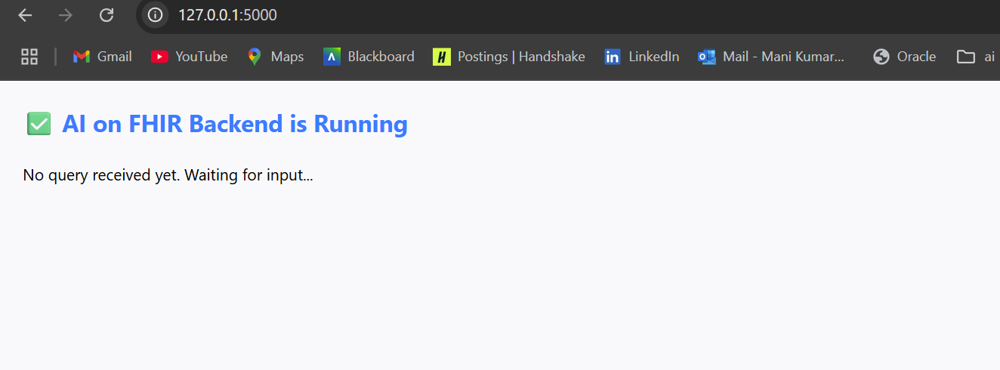
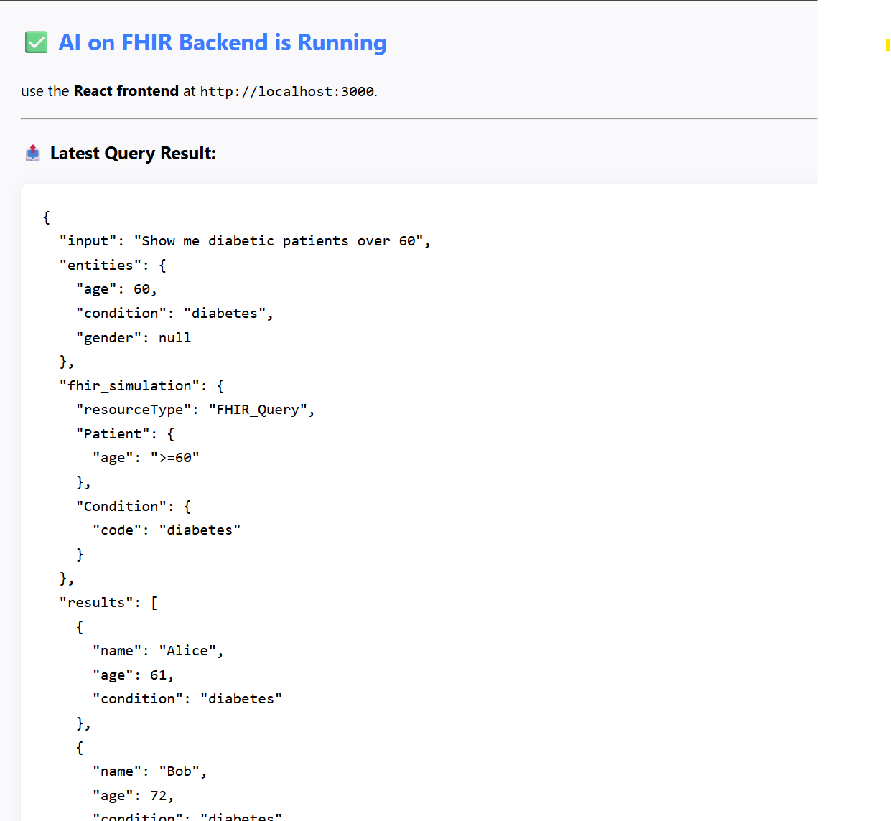

<<<<<<< HEAD
=======

# 🧠 AI on FHIR – Full Stack App (NLP + FHIR Dashboard)

This project is a full-stack application that lets users enter **natural language queries** (like “Show me diabetic patients over 60”), and see structured **FHIR-style data** and patient statistics visualized in a professional UI.

---

## ✅ Features

### 🔙 Backend (Python + Flask)
- NLP using `spaCy` to extract conditions and age
- Converts queries to simulated FHIR API structure
- Returns mock patient data with age filtering
- Auto-refresh server view shows latest query result

### 🖥️ Frontend (React)
- Search bar with live suggestions and clickable examples
- Displays patient results in a styled table
- Filter dropdown for age groups
- Recharts-powered pie chart visualizing patient age distribution
- Professional UI with header/footer, responsive layout

---

## 📁 Folder Structure

```
ai-on-fhir/
├── backend/
│   ├── app.py
│   ├── fhir_mapper.py
│   ├── nlp_parser.py
│   └── requirements.txt
└── fhir-ui/
    ├── src/
    │   ├── App.js
    │   └── App.css
    └── package.json
```

---

## 🚀 Getting Started

### 🔧 Backend Setup

```bash
cd backend
pip install -r requirements.txt
python -m spacy download en_core_web_sm
python app.py
```

This runs a Flask server at: `http://localhost:5000`

### 🌐 Frontend Setup

```bash
cd fhir-ui
npm install
npm start
```

Runs the React frontend at: `http://localhost:3000`

---

## 📸 UI & Backend Screenshots

### 🏠 Home Page  


### 📋 age filter and table results  


### 📊 pie chart  


### ⚙️ backend-started  


### 🔎 backend-query-result  


## 💡 Example Queries

- "Show me diabetic patients over 60"
- "List asthma patients over 70"
- "Get cancer patients over 75"
- "Find flu patients older than 50"
- "Patients with hypertension over 65"

---

## 🛡️ Notes

- Backend uses mock data only (no real FHIR server)
- Frontend displays live results and filters
- Designed for demo purposes only – no PHI is stored

---

© 2025 Mani Kumar Edukoju – Demo Project for AI on FHIR Interview Task
>>>>>>> 58d1208331a09ad060ac59799ca118562b163745
