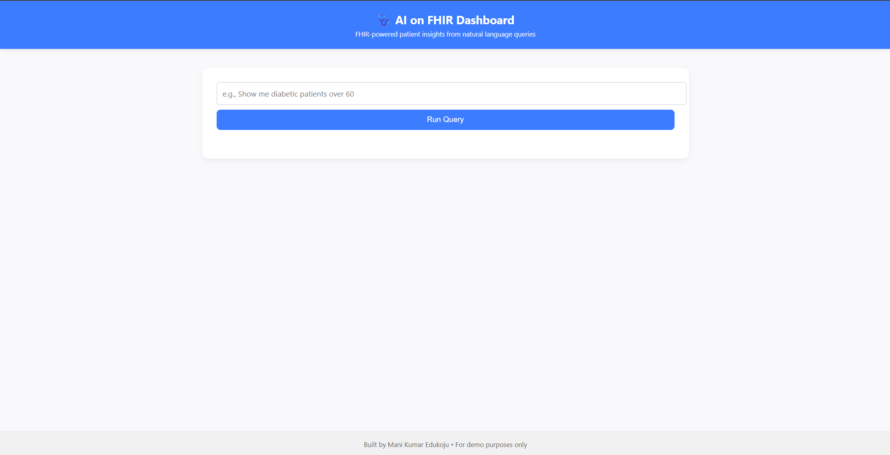
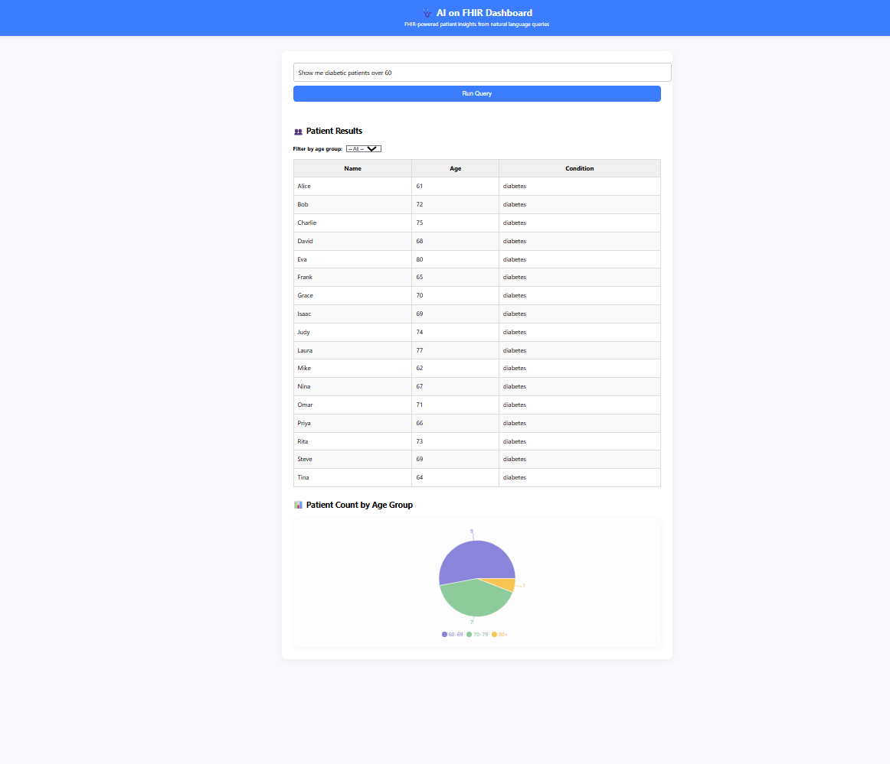
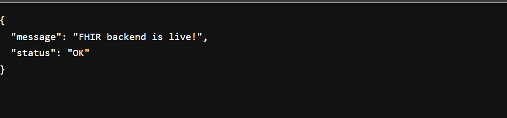

# 🧠 AI on FHIR – NLP to FHIR Backend (Part 1)

This Python-based service accepts natural language queries (e.g., “Show me all diabetic patients over 50”) and converts them into a simulated [FHIR](https://www.hl7.org/fhir/) API request using `Patient` and `Condition` resources. It uses basic NLP techniques to extract clinical concepts and conditions from user input.

---

## ✅ Features

* Entity extraction using `spaCy` (age, condition)
* Maps free text to a simulated FHIR query structure
* Mock patient result generation
* Flask API endpoint (`/query`)
* CORS enabled to support frontend calls

---

## 📁 Files

| File                | Description                               |
| ------------------- | ----------------------------------------- |
| `app.py`            | Flask server with POST `/query` endpoint  |
| `nlp_parser.py`     | NLP logic to extract age and condition    |
| `fhir_mapper.py`    | Translates entities into FHIR-style query |
| `requirements.txt`  | Python dependencies                       |
| `example_inputs.md` | Example input/output pairs                |

---

## 🚀 How to Run

### 1. Install Dependencies

```bash
pip install -r requirements.txt
python -m spacy download en_core_web_sm
```

### 2. Start the Server

```bash
python app.py
```

Your backend will be available at:
`http://localhost:5000/query`

---

## 📥 Example Input / Output

### Input 1:

```json
{ "query": "Show me diabetic patients over 60" }
```

### Output:

```json
{
  "input": "Show me diabetic patients over 60",
  "entities": {
    "age": 60,
    "condition": "diabetes"
  },
  "fhir_simulation": {
    "resourceType": "FHIR_Query",
    "Patient": { "age": ">=60" },
    "Condition": { "code": "diabetes" }
  },
  "results": [ ...mock patients... ]
}
```

---

## 🛠 Tech Stack

* Python 3.x
* Flask
* spaCy (with `en_core_web_sm`)
* Simulated FHIR query model (not connected to live FHIR server)

---

below images shows the working React UI with query input, results table, and pie chart.





below image shows the backend terminal output or the response payload from the API.


## 📌 Notes

* This service uses mock patient data and does not query a real EHR/FHIR server.
* Conditions supported: diabetes, asthma, cancer, flu, covid, hypertension
* Age filters supported: "over", "older than", "age above" + number

